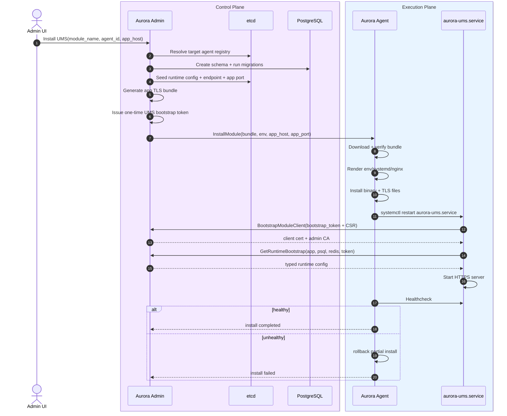
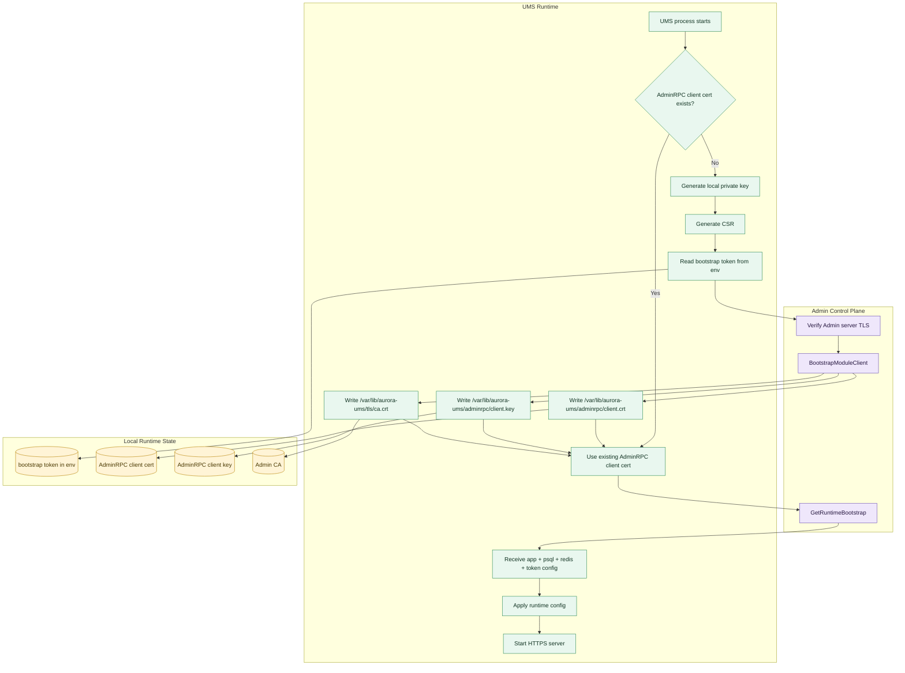

# Aurora UMS

## Install Flow

## Runtime Paths

- `env`: `/var/lib/aurora-ums/config/ums.env`
- `app tls`: `/var/lib/aurora-ums/tls`
- `admin rpc client tls`: `/var/lib/aurora-ums/adminrpc`

## Bootstrap Phases

